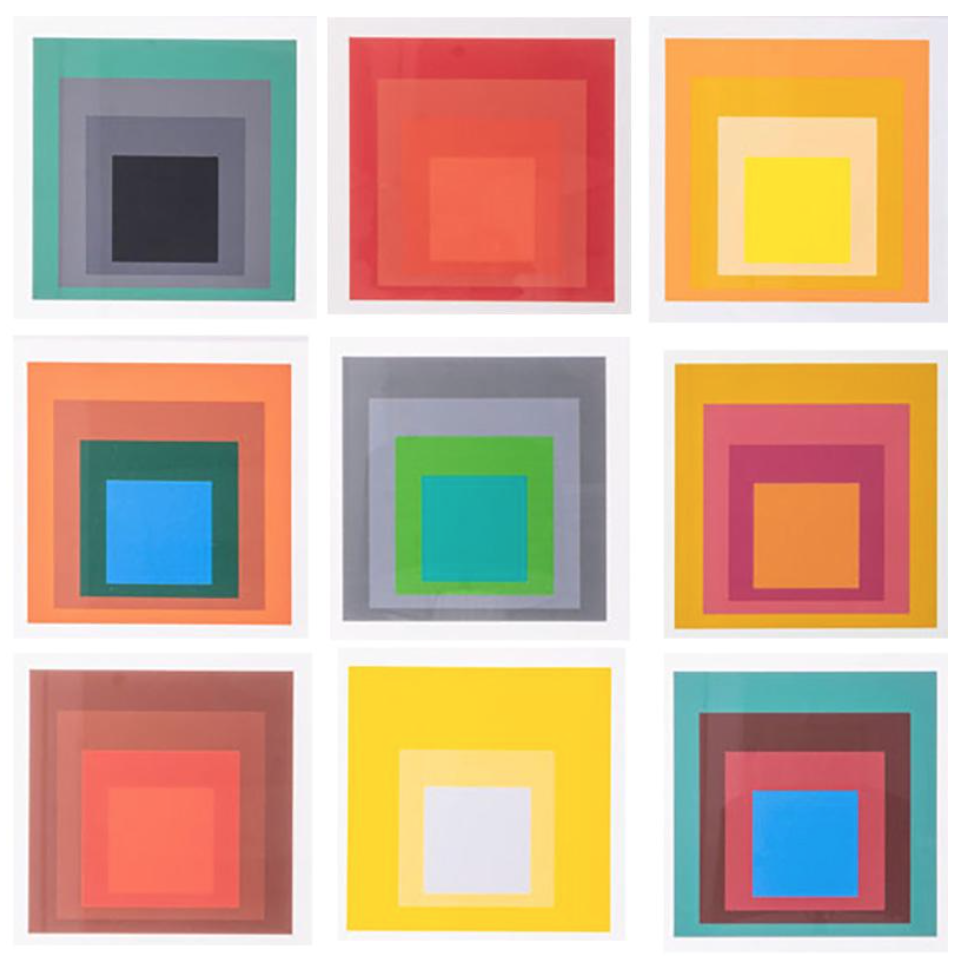
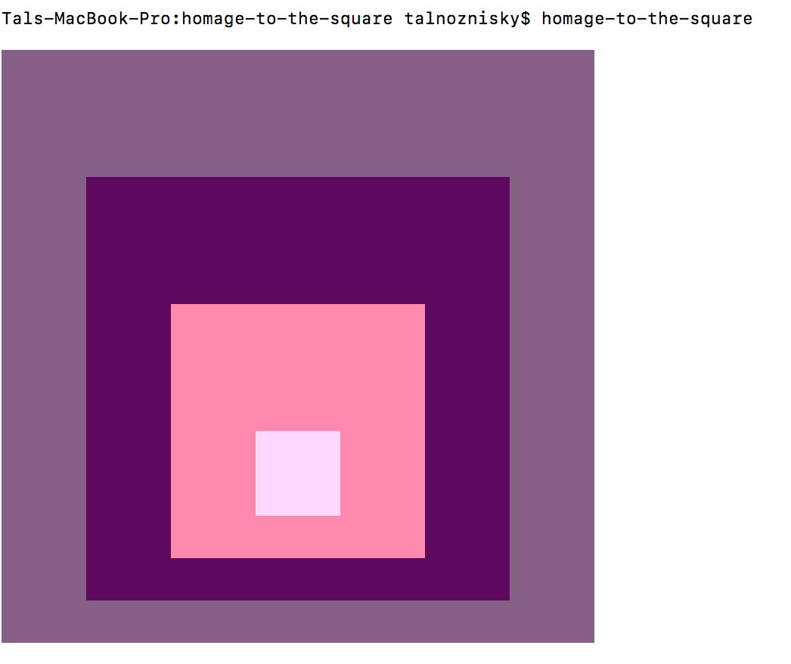

# Homage to the square
a command line app for generating four superimposed squares of different colors 
after Josef Albers `Homage to the Square` paintings

# Requirements
Python 3

# Installation
## Using Pip
```bash
  $ pip install homage-to-the-square
```
## Manual
```bash
  $ git clone https://github.com/talnoznisky/homage-to-the-square
  $ cd homage
  $ python setup.py install
```
# Usage
```bash
$ homage-to-the-square
```
# Examples
Originals:



CLI output:



## More info:
https://www.guggenheim.org/artwork/173
